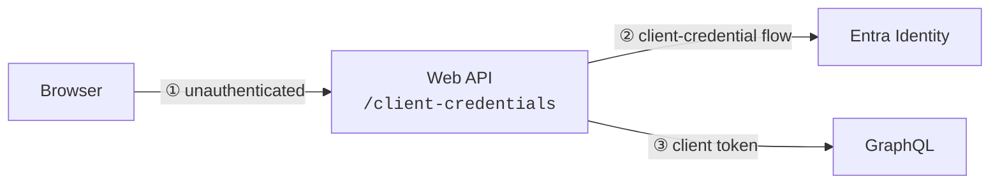
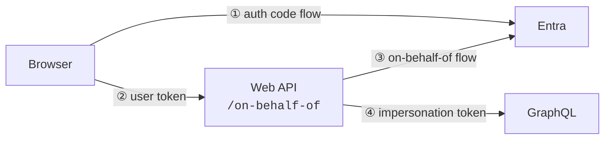

# entra-playground

Azure Entra OAuth 2.0 and GraphQL Tests

## Flows

This application demonstrates two ways to call the Microsoft GraphQL from a WebAPI

### Client Credential Flow

The client credential flow demonstrates system-to-system calls to the Microsoft GraphQL

1.  user call Web API anonymously
2.  WebAPI requests a system token from Entra using the Client Credential flow
3.  WebAPI calls GraphQL using system token

### On-Behalf-Of Flow

The on-behalf-of flow demonstrates a mediated user call to the Microsoft GraphQL

1. user requests a user token froom Entra using Auth Code flow
2. user calls web API using user token
3. WebAPI requests an impersonation token from Entra using on-behalf-of flow
4. WebAPI calls GraphQL using impersonation token

## Endpoints:

Endpoints to test the flow:
* `/api/graphql/client-credential` : call microsoft graphql with client credential flow
* `/api/graphql/on-behalf-of`: call microsoft graphql with on-behalf-of flow

Endpoints to mediate and test the authorization code flow:

* `/api/oauth/validate`: validate the oauth jwt access token
* `/api/oauth/authorize`: oauth authorize endpoint mediator
* `/api/oauth/token`: oauth token endpont mediator 